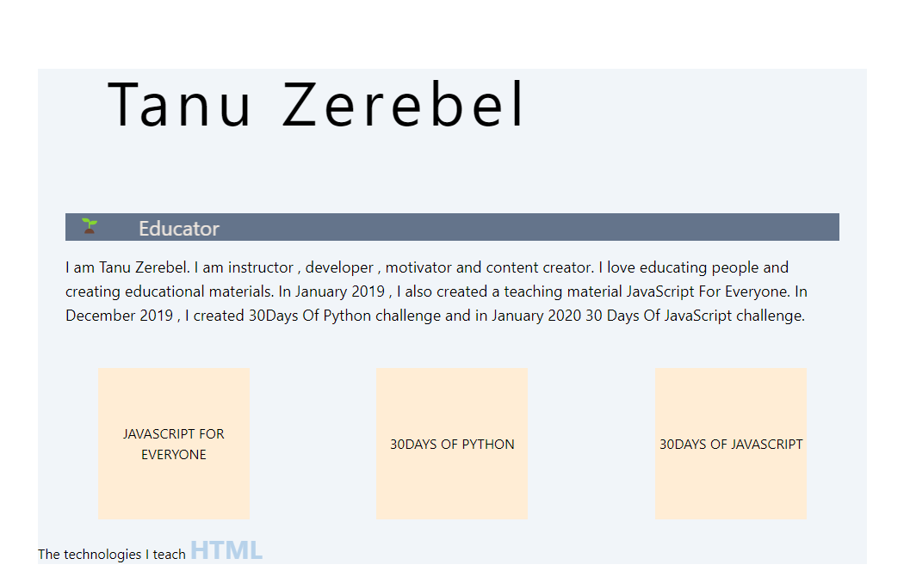

<h1 align="center">Portfolio Project</h1>

A portfolio project for 30Days of Javascript

   Solution for a project from  <a href="https://github.com/Asabeneh/30-Days-Of-JavaScript/blob/master/27_Day_Mini_project_portfolio/27_day_mini_project_portfolio.md" target="_blank">30 Days Of Javascript</a>.

  <h3>
    <a href="https://zerebel.github.io/portfolio-project/">
      Demo
    </a>
     | 
    <a href="https://github.com/Zerebel/portfolio-project/">
      Repo
    </a>
  </h3>

<!-- TABLE OF CONTENTS -->

## Table of Contents

- [Overview](#overview)
- [Built With](#built-with)
- [Features](#features)
- [Contact](#contact)

<!-- OVERVIEW -->

## Overview

....

Demo URL: https://zerebel.github.io/portfolio-project/

### Built With

<!-- This section should list any major frameworks that you built your project using. Here are a few examples.-->

-HTML
-TailwindCSS
-Sass
-Javascript

## Features

<!-- List the features of your application or follow the template. Don't share the figma file here :) -->

This application/site was created as a submission to a [30 days of javascript](https://github.com/Asabeneh/30-Days-Of-JavaScript/) project. The [project](https://github.com/Asabeneh/30-Days-Of-JavaScript/blob/master/27_Day_Mini_project_portfolio/27_day_mini_project_portfolio.md) was to build a portfolio website matching the given illustration.

## Contact

- GitHub [@Zerebel](https://github.com/Zerebel)
- Twitter [@Zerebel\_](https://twitter.com/zerebel_)
